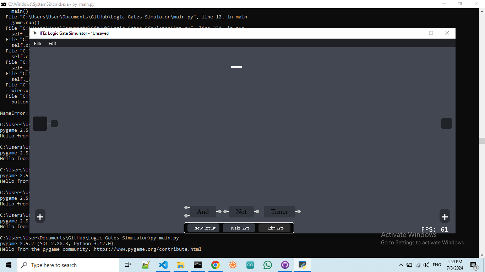
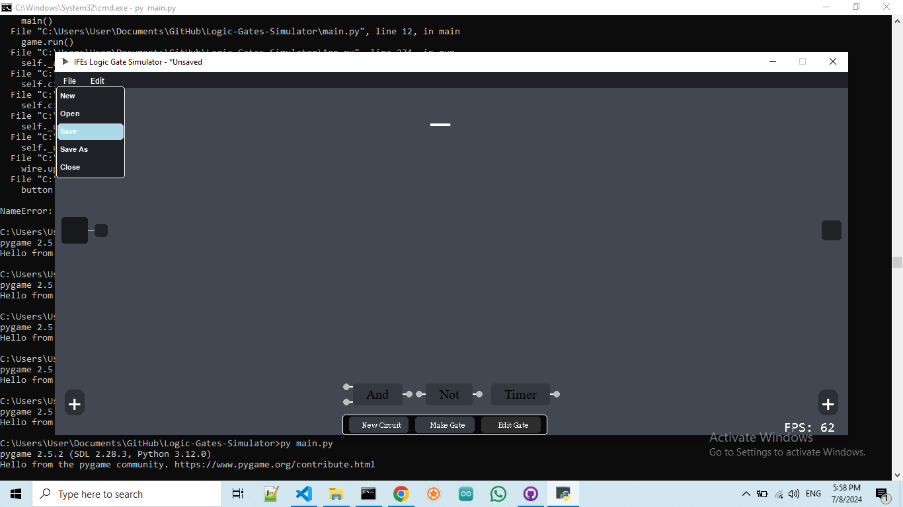
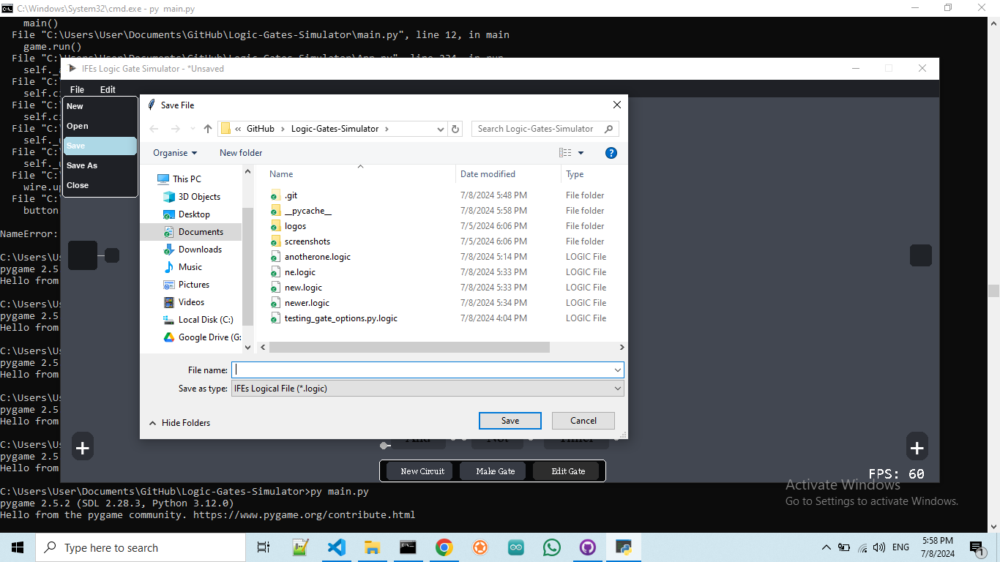
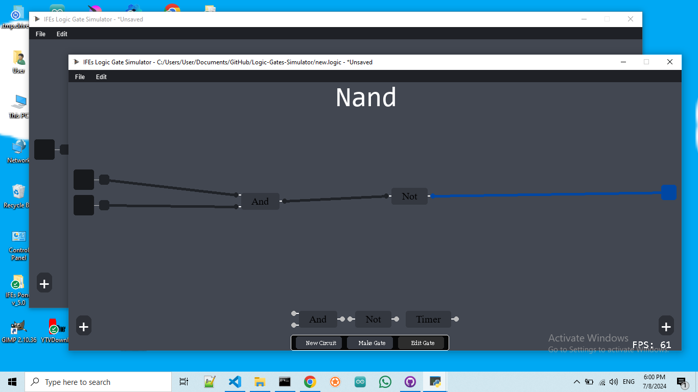
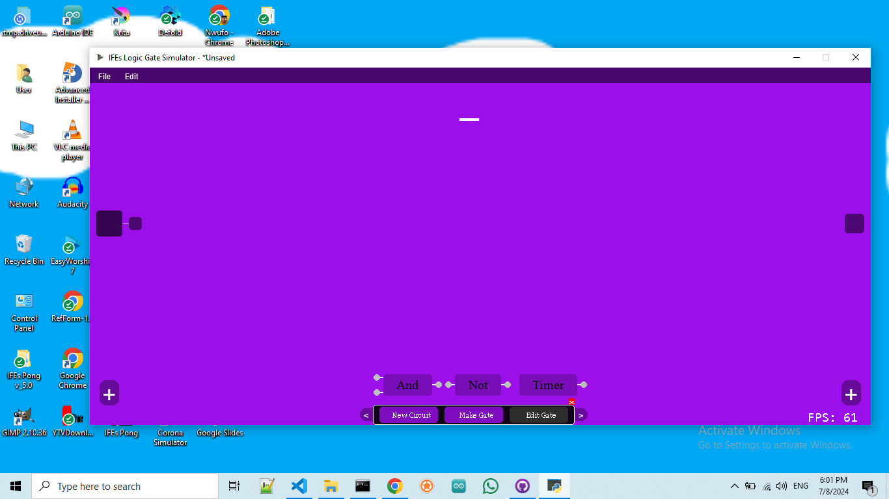

# Logic Gates Simulator 🖥️🔌

## Overview

**Logic Gates Simulator** is a Python application built with Pygame that allows users to create, simulate, visualize and save logic circuits. This app provides an intuitive graphical interface for designing logic circuits using basic logic gates like AND, NOT, and even a TIMER gate. It also supports custom text input for labeling components using the `pygame-textinput` library.

## Features

- **Graphical Interface:** Design logic circuits using a simple drag-and-drop interface.
- **Logic Gates:** Includes all basic logic gates (AND, NOT, TIMER).
- **Custom Labels:** Use `pygame-textinput` for adding labels to your components.
- **Simulation:** Simulate the logic circuit to observe the output in real-time.
- **Ability to Save and Load Circuits:** Circuits can now be saved and loading into a binary file, which opens many new posiblities

## Requirements

- Python 3.7 or higher
- Pygame
- pygame-textinput

## Installation

1. **Clone the repository:**

```sh
   git clone https://github.com/ifeisachildofGod/Logic-Gates-Simulator.git
   cd Logic-Gates-Simulator
```
2. **Install dependencies**:

```sh
    pip install pygame pygame-textinput
```

## Usage

1. **Run the application:**

```sh
    python main.py
```

2. **Designing Circuits:**

- Use the graphical interface to drag and drop logic gates onto the workspace.
- Connect the gates by dragging from the output of one gate to the input of another.
- Use the text input feature to label gates and connections.

3. **Simulating Circuits:**

- Adjust the inputs and see how the output changes.

## Contributing

Contributions are welcome! If you have suggestions for improvements or new features, feel free to open an issue or create a pull request.

## License

This project is licensed under the MIT License. See the [LICENSE](LICENSE) file for details.

## Acknowledgements

- [Pygame](https://www.pygame.org) - The library used for creating the graphical interface.
- [Pygame-textinput](https://github.com/DYGV/pygame_textinput) - The library used for custom text input.

## Contact

You can contact me, Nwufo Ifechukwu at my [Email](nwufoife@gmail.com) and check out my other projects on my [GitHub](https://github.com/ifeisachildofGod), if you don't want to have to run the code yourself you can download the full app executeable on my [Itch.io Page](https://theisachildofgod.itch.io/ifes-logic-gates-simulator)

## Screenshots






## Directory Structure

```plaintext
    Logic-Gates-Simulator/
    ├── LICENSE
    ├── README.md
    ├── main.py
    ├── logic_circuits_display.py
    ├── logic_gates_components.py
    ├── modules.py
    ├── settings.py
    ├── signal_transfer.py
    ├── widgets.py
    ├── save.py
    └── themes.json
```